# Sensor Models

## Overview
This repository contains the solution for CMP2024 Robotics course Assignment 1, focusing on sensor models for laser-range measurements and their likelihood fields. The assignment involves generating laser-range measurements using ray casting and implementing the endpoint model for these measurements. 

## Problem 1

**Objective:** Generate laser-range measurements for a given robot pose (x, y, θ) on a 2D grid-map using ray casting. 

**Method:** 

1. A map image is loaded using OpenCV.
2. Laser-range measurements are generated for an opening angle of 250° (125° left and right of the heading direction) with measurements taken every 2°. 
3. The endpoint of each laser ray is determined by checking for obstacles within a maximum range of 12 meters (converted to pixels). 
4. The measurements, including endpoints and distances for each angle, are saved in the measurements.txt file. 
5. The map with drawn rays is displayed using Matplotlib. 

**Code Explanation:** 

- The get_end_point function calculates the endpoint of a ray given the start point, angle, and maximum range. 
- The validate_input function ensures the robot's pose is within the bounds of the map. 
- The cast_rays function performs ray casting, stores measurements, and visualizes the results on the map. 

**Figures** 

Pose 1: (x = 350, y = 190, θ = 90°) 
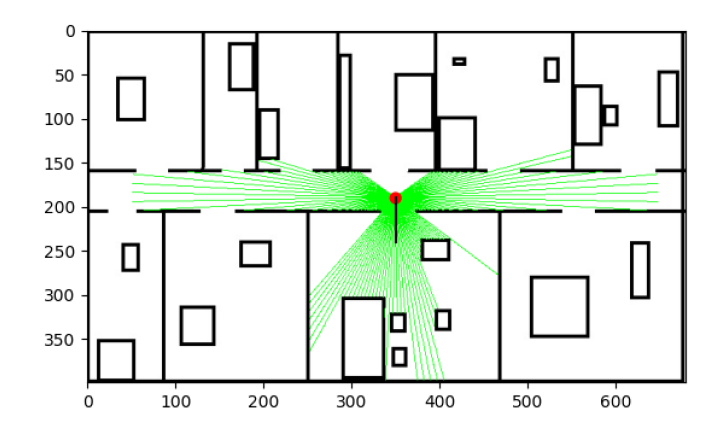 
Pose 2: (x = 30, y = 190, θ = 50°) 
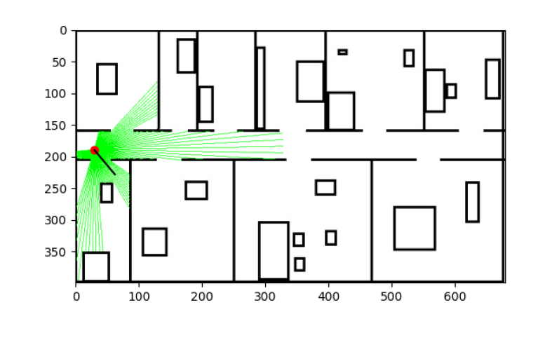 
The measurements, including endpoints and distances for each angle, are saved in the measurements.txt file. 

## Problem 2
**Objective:** Implement the endpoint model for laser-range measurements and compute the likelihood field for different sigma values and maximum ray lengths. 

**Method:** 
1. The map image is binarized using Otsu's thresholding. 
2. A likelihood field is computed using a Gaussian model applied to the distance transform of the binary map. 
3. For each cell in the map, the maximum likelihood over all orientations is computed and visualized as a grayscale value. 
4. The results for different sigma values and maximum ray lengths are saved as images. 

**Code Explanation:** 
-The calculate_likelihood_field function computes the likelihood field using a Gaussian model. 
- The endpoint_model function calculates the probability map for different sigma values and maximum ray lengths and saves the results as images. 
  
1. Likelihood Field at Different Sigmas: 
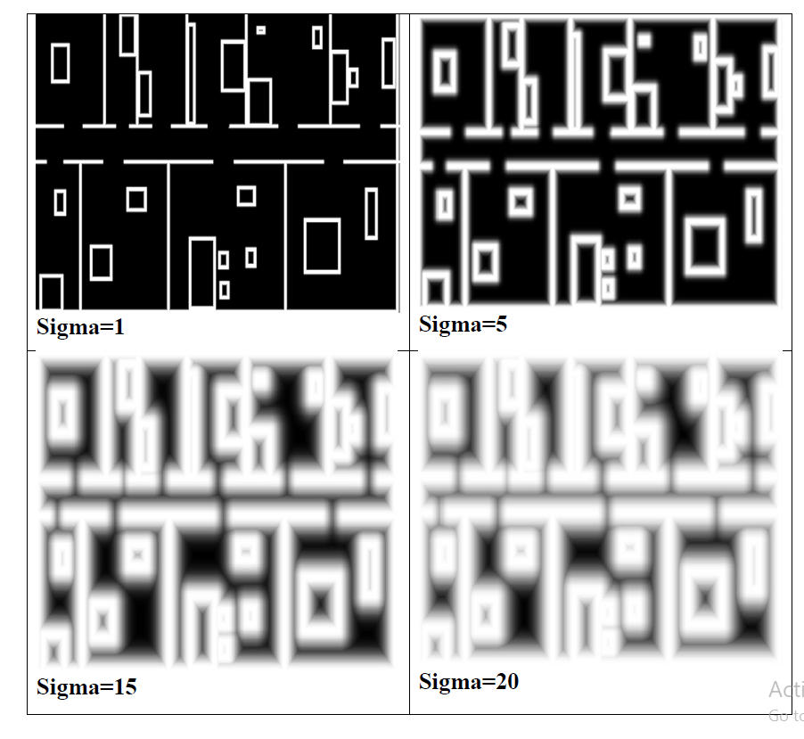 
2. Probability Map at Different Sigmas and Max_ray Values: 
Sigma = 1 
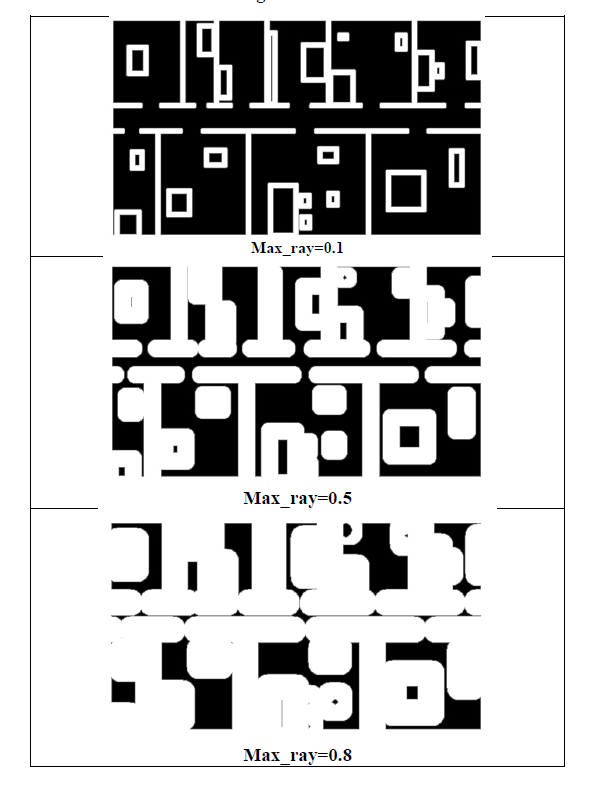 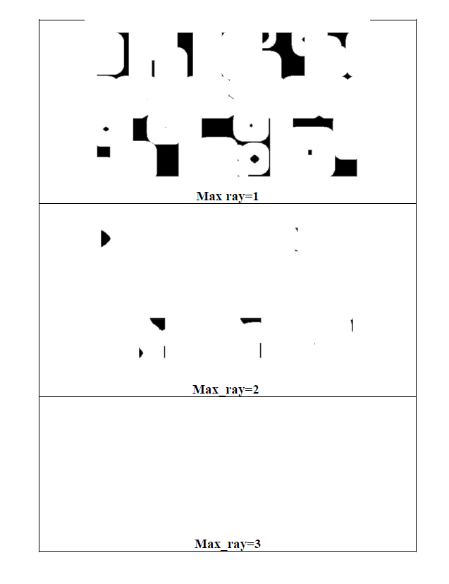 
Sigma = 5 
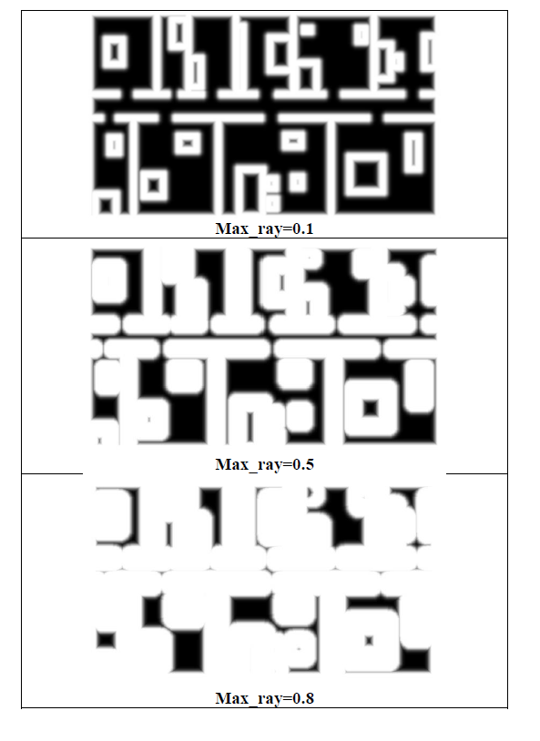 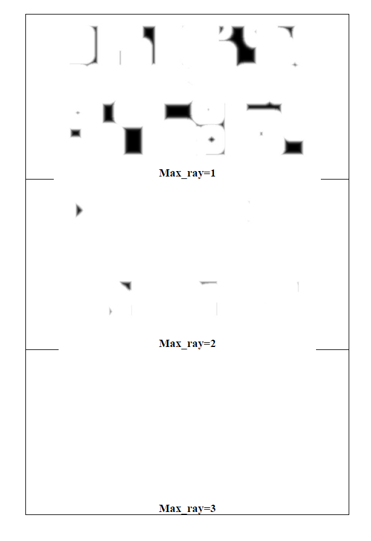 
Sigma = 15 
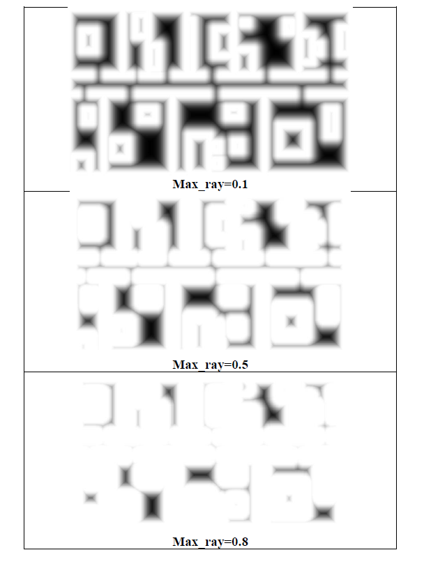 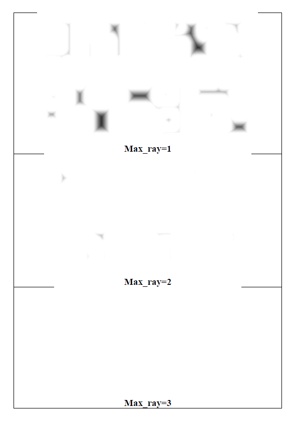 
Sigma = 20 
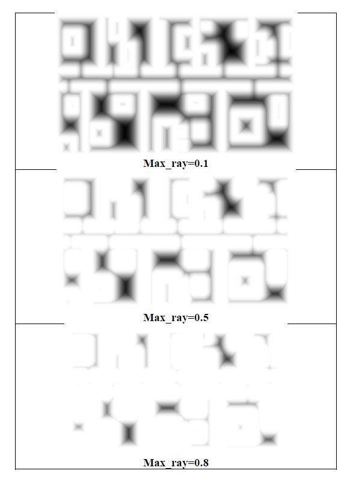 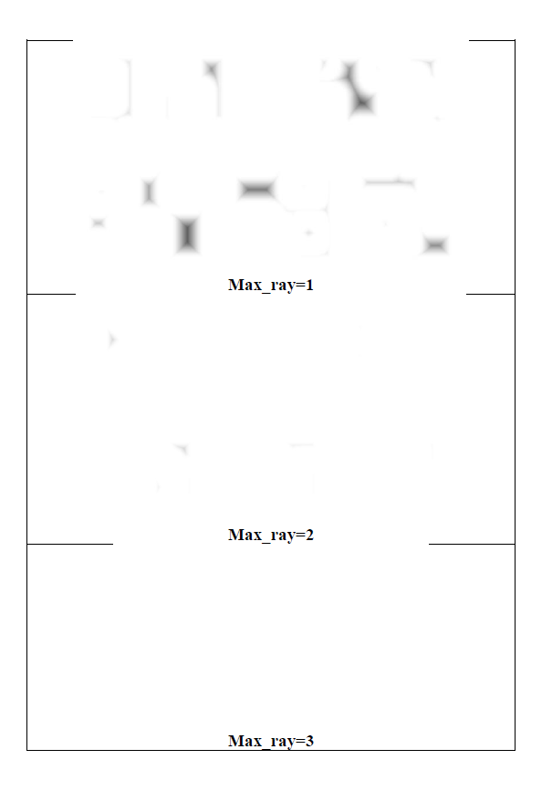 
